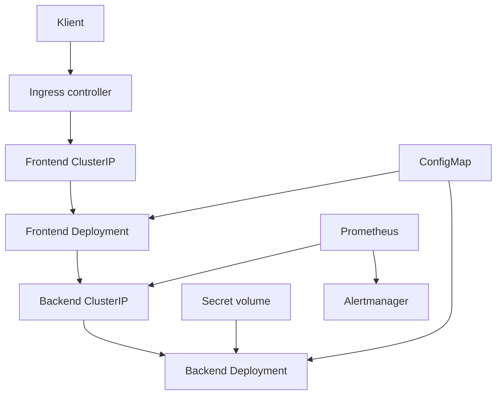

# Produkčné prostredie pre webovú aplikáciu v Kubernetes

Kompletné referenčné riešenie zadania: statický NGINX frontend, Go backend, Helm, RBAC,
NetworkPolicy, HPA, Argo CD, GitHub Actions a kube-prometheus-stack. `kind` profil je určený
na lokálnu demonštráciu produkčných princípov; samotný lokálny cluster nie je produkčná
platforma ani vysoko dostupná infraštruktúra.

## Architektúra



Frontend je jediný aplikačný vstup z Ingressu. NGINX posiela `/api/*` na internú backend
Service. Backend nie je priamo vystavený mimo cluster. Prometheus číta `/metrics` cez
backend Service.

## Pokrytie zadania

| Požiadavka | Implementácia |
| --- | --- |
| Frontend a backend Deployment | `helm/webapp/templates/deployment-*.yaml`, rolling update, probes, resources, 2+ repliky |
| ClusterIP + Ingress | dve interné Services; Ingress smeruje na frontend |
| ConfigMap + Secret | aplikačné premenné a NGINX konfigurácia v ConfigMap; API kľúč ako read-only Secret volume |
| Škálovanie | samostatný HPA pre oba komponenty podľa CPU a pamäte, PDB a topology spread |
| RBAC | dve ServiceAccounts bez tokenu; namespace Role/RoleBinding iba na čítanie, bez prístupu k Secrets |
| NetworkPolicy | default deny; iba Ingress→frontend, frontend→backend, Prometheus→backend a DNS |
| GitOps | Argo CD Application s automatickým sync, prune a self-heal |
| CI/CD | testy, render chartu, build/push dvoch obrazov, update a package chartu, Git commit desired state |
| Monitoring | ServiceMonitor, tri aplikačné alerty, Prometheus, Alertmanager a Grafana |
| Dokumentácia | tento README, bezpečnostné rozhodnutia, lokálny a GitOps postup, testy |

Kubernetes Deployment spravuje deklaratívne aktualizácie Podov, Service poskytuje stabilný
sieťový endpoint a Ingress vyžaduje samostatný controller; tieto roly zodpovedajú oficiálnej
dokumentácii [Deployment](https://kubernetes.io/docs/concepts/workloads/controllers/deployment/),
[Service](https://kubernetes.io/docs/concepts/services-networking/service/) a
[Ingress](https://kubernetes.io/docs/concepts/services-networking/ingress/).

## Štruktúra repozitára

```text
backend/                 Go HTTP API, metriky, testy, distroless image
frontend/                HTML/CSS/JS a unprivileged NGINX image
helm/webapp/             aplikačný Helm chart a production overlay
argocd/                  AppProject a Application
monitoring/              lokálne a produkčné values pre kube-prometheus-stack
cluster/                 trojuzlový kind a Calico konfigurácia
scripts/                 bootstrap, verifikácia a automatický update chartu
.github/workflows/       pull-request CI a release/GitOps pipeline
```

## Lokálne spustenie v kind

### Predpoklady

- Docker alebo kompatibilný runtime podporovaný nástrojom kind,
- `kind` v0.33.0,
- `kubectl`, Helm a prístup k verejným registries/repozitárom,
- voľné lokálne TCP porty 80 a 443.

Použitý kind node `v1.36.4` je pripnutý SHA-256 digestom z oficiálnych release notes
[kind v0.33.0](https://github.com/kubernetes-sigs/kind/releases/tag/v0.33.0). kind dokumentácia
odporúča pre reprodukovateľnosť používať digest, nie iba tag
([Quick Start](https://kind.sigs.k8s.io/docs/user/quick-start/#setting-kubernetes-version)).

Spustenie:

```bash
chmod +x scripts/*.sh
WEBAPP_API_KEY='replace-this-local-value' ./scripts/bootstrap-kind.sh
```

Skript vytvorí jeden control-plane a dva worker nody, nainštaluje Calico, Ingress controller,
Metrics Server, Prometheus/Alertmanager/Grafana, Argo CD a aplikáciu. HPA potrebuje resource
metrics; Metrics Server je podľa svojho projektu zdroj metrík pre zabudované autoscaling
pipeline ([Metrics Server](https://github.com/kubernetes-sigs/metrics-server)). Calico je v
tomto profile potrebné, aby sa NetworkPolicy nielen vytvorili, ale aj vynucovali.

Do lokálneho `hosts` súboru pridajte:

```text
127.0.0.1 k8s-demo.local
```

Potom otvorte `http://k8s-demo.local` alebo použite:

```bash
curl http://k8s-demo.local/api/message
curl -H 'X-API-Key: replace-this-local-value' http://k8s-demo.local/api/private
kubectl -n webapp get deploy,pod,svc,ingress,hpa,pdb,networkpolicy
```

Lokálny fallback `local-development-key`, ktorý skript použije bez premennej
`WEBAPP_API_KEY`, je výhradne demo hodnota.

Odstránenie lokálneho clusteru:

```bash
kind delete cluster --name webapp
```

## Priama Helm inštalácia

Monitoring CRD musia existovať, pokiaľ sú `serviceMonitor.enabled` a `alerts.enabled` zapnuté.
Bez monitoringu nastavte obe hodnoty na `false`.

```bash
kubectl create namespace webapp
kubectl -n webapp create secret generic webapp-secrets --from-literal=api-key='replace-me'
helm lint helm/webapp
helm upgrade --install webapp helm/webapp --namespace webapp
```

Cloud overlay je šablóna, nie hotová konfigurácia konkrétneho providera. Pred použitím sa
musia nastaviť doména, storage class, TLS Secret a nemenné image tagy:

```bash
helm upgrade --install webapp helm/webapp \
  --namespace webapp \
  --values helm/webapp/values-production.yaml
```

## GitOps a CI/CD

Tok nasadenia je zámerne rozdelený:

1. Pull request spustí `.github/workflows/ci.yaml`: Go testy, test update skriptu, Helm lint,
   render manifestov a build oboch image bez publikovania.
2. Zmena `backend/` alebo `frontend/` na `main` spustí release workflow.
3. Workflow vytvorí a odošle oba obrazy s nemenným tagom celého Git commit SHA.
4. `scripts/update_chart.py` vloží presné repository/tag hodnoty, zvýši patch verziu chartu,
   chart zabalí a odošle ako OCI package do GHCR.
5. Workflow commitne zmenený `Chart.yaml` a `values.yaml` späť do `main`.
6. Argo CD zmenu v Gite zistí a automaticky zosynchronizuje; `prune` odstráni už nechcené
   objekty a `selfHeal` opraví drift. Správanie týchto volieb je popísané v oficiálnej
   dokumentácii [Argo CD Automated Sync Policy](https://argo-cd.readthedocs.io/en/stable/user-guide/auto_sync/).

Nastavenie:

```bash
kubectl apply -f argocd/project.yaml
kubectl apply -f argocd/application.yaml
```

Pred aplikovaním musí existovať namespace `webapp` a Secret `webapp-secrets`; Secret sa do
Gitu neukladá. Pre súkromný repozitár treba Argo CD nakonfigurovať read-only credential.
V GitHub repository settings musí mať workflow povolené `Read and write permissions`.
Ak je `main` chránený proti priamemu pushu, krok desired-state update treba zmeniť na
automatické vytvorenie pull requestu alebo použiť schválenú GitHub App—workflow túto politiku
neobchádza.

GitHub oficiálne dokumentuje publikovanie image do registry cez Actions vrátane oprávnenia
`packages: write` v návode [Publishing Docker images](https://docs.github.com/en/actions/use-cases-and-examples/publishing-packages/publishing-docker-images).

## Bezpečnostný model

- Kontajnery bežia ako non-root, s `readOnlyRootFilesystem`, `seccompProfile: RuntimeDefault`,
  bez Linux capabilities a bez možnosti privilege escalation.
- Workload ServiceAccounts nemajú automaticky mountnutý Kubernetes API token a nemajú RoleBinding.
- Read-only skupina môže čítať prevádzkové objekty, ale pravidlá jej nepovoľujú Secrets.
- Default-deny NetworkPolicy izoluje oba komponenty. NetworkPolicy funguje iba s pluginom,
  ktorý ju implementuje; túto podmienku uvádza Kubernetes
  [Network Policies](https://kubernetes.io/docs/concepts/services-networking/network-policies/).
- Secret sa mountuje ako súbor s režimom `0440`; skupinové čítanie potrebuje non-root proces
  s Pod `fsGroup`. Secret nie je vložený do image ani do ConfigMap.
  Kubernetes upozorňuje, že Secret je štandardne uložený v etcd nezašifrovaný, a odporúča
  encryption at rest, least-privilege RBAC a externý secret store
  ([Good practices for Kubernetes Secrets](https://kubernetes.io/docs/concepts/security/secrets-good-practices/)).
- HPA má resource requests, pretože percentuálne resource utilization sa počíta voči requests
  ([Horizontal Pod Autoscaling](https://kubernetes.io/docs/tasks/run-application/horizontal-pod-autoscale/)).
- PDB chráni dostupnosť pri dobrovoľných narušeniach; negarantuje ochranu pred všetkými
  výpadkami podľa [Disruptions](https://kubernetes.io/docs/concepts/workloads/pods/disruptions/).

Overenie RBAC:

```bash
kubectl auth can-i list pods -n webapp --as=peter --as-group=webapp-viewers
kubectl auth can-i get secrets -n webapp --as=peter --as-group=webapp-viewers
# Očakávanie: yes, potom no.
```

Overenie zamietnutia prístupu z neautorizovaného Podu:

```bash
kubectl -n webapp run denied-client --rm -it --restart=Never \
  --image=curlimages/curl -- curl --max-time 3 http://webapp-backend:8080/healthz
# Očakávanie: timeout; backend povoľuje iba frontend Pody a Prometheus namespace.
```

## Monitoring a alerty

Prometheus Operator používa `ServiceMonitor` na deklaratívny výber scrape targetov a
`PrometheusRule` na alerting/recording rules; oba typy sú dokumentované v
[API reference](https://prometheus-operator.dev/docs/api-reference/api/).

```bash
kubectl -n monitoring port-forward svc/monitoring-kube-prometheus-prometheus 9090:9090
kubectl -n monitoring port-forward svc/monitoring-kube-prometheus-alertmanager 9093:9093
kubectl -n monitoring port-forward svc/monitoring-grafana 3000:80
```

| Alert | Predvolená podmienka | Pôvod čísla |
| --- | --- | --- |
| `WebAppBackendTargetDown` | aspoň jeden target je down 5 minút | návrhový default v `monitoring.yaml`; upraviť podľa SLO |
| `WebAppDeploymentUnavailable` | menej dostupných než požadovaných replík 10 minút | návrhový default v `monitoring.yaml`; upraviť podľa SLO |
| `WebAppBackendHighErrorRate` | 5xx pomer > 0,05 počas 10 minút a traffic > 0,1 req/s | prahy `alerts.errorRateThreshold=0.05` a `alerts.minimumRequestRate=0.1` vo `values.yaml`; nejde o namerané hodnoty |

Alertmanager v lokálnom profile používa receiver `null`, takže upozornenia možno vidieť v UI,
ale neodosielajú sa mimo cluster. V produkcii treba pridať reálny receiver (napríklad firemný
e-mail/PagerDuty/Slack) a jeho credential cez Secret.

## Testy a verifikácia

```bash
./scripts/verify.sh
```

Skript vykoná Go unit testy, test bezpečnej aktualizácie chartu, Helm lint/render a oba Docker
buildy. Po nasadení skontrolujte aj rollout, endpointy, Prometheus targets, aktívne rules a
NetworkPolicy/RBAC testy uvedené vyššie.

## Verzie bootstrap komponentov

Verzie boli overené voči oficiálnym release stránkam **3. septembra 2026** a v skripte sú
pripnuté pre reprodukovateľnosť.

| Komponent | Verzia | Overiteľný zdroj |
| --- | ---: | --- |
| Helm (CI) | 4.2.4 | [Helm v4.2.4](https://github.com/helm/helm/releases/tag/v4.2.4) |
| kind | 0.33.0 | [kind releases](https://github.com/kubernetes-sigs/kind/releases/tag/v0.33.0) |
| Kubernetes node | 1.36.4 + SHA-256 digest | [kind v0.33.0 images](https://github.com/kubernetes-sigs/kind/releases/tag/v0.33.0) |
| Calico | 3.32.2 | [Calico v3.32.2](https://github.com/projectcalico/calico/releases/tag/v3.32.2) |
| ingress-nginx chart | 4.15.1 | [ingress-nginx 4.15.1](https://github.com/kubernetes/ingress-nginx/releases/tag/helm-chart-4.15.1) |
| Metrics Server chart | 3.14.0 | [Metrics Server chart 3.14.0](https://github.com/kubernetes-sigs/metrics-server/releases/tag/metrics-server-helm-chart-3.14.0) |
| kube-prometheus-stack | 88.6.3 | [kube-prometheus-stack 88.6.3](https://github.com/prometheus-community/helm-charts/releases/tag/kube-prometheus-stack-88.6.3) |
| Argo CD chart | 10.7.0 | [Argo Helm 10.7.0](https://github.com/argoproj/argo-helm/releases/tag/argo-cd-10.7.0) |

Pozor: oficiálny `kubernetes/ingress-nginx` repozitár bol archivovaný 24. marca 2026, čo je
viditeľné priamo na [stránke repozitára](https://github.com/kubernetes/ingress-nginx). Je tu
ponechaný ako pripnutý lokálny controller pre kompatibilitu so zadaním. Pre nové reálne
produkčné nasadenie treba po posúdení platformy zvoliť udržiavaný Ingress/Gateway controller;
samotný aplikačný Ingress manifest nie je viazaný na NGINX anotácie.

## Čo ešte musí dodať konkrétna produkčná platforma

Tento repozitár nemôže bez znalosti cieľového cloudu pravdivo deklarovať úplné produkčné
nasadenie. Pred go-live treba najmenej:

- multi-AZ managed cluster, node pools, autoscaling a cloud load balancer,
- DNS, TLS issuer/certifikáty a udržiavaný Ingress alebo Gateway controller,
- externý secret manager, encryption at rest, rotáciu a audit,
- privátny registry policy, vulnerability scanning, podpis/verifikáciu obrazov a SBOM,
- konkrétne SLO, alert receivers, on-call proces, perzistentný/remote monitoring storage,
- zálohy, disaster-recovery test, policy enforcement a cloud IAM mapping pre `webapp-viewers`,
- load, resilience, restore, security a upgrade testy.

Tieto body sú závislé od GKE/EKS/AKS a organizačných politík; preto v projekte nie sú
prezentované ako už implementované.
